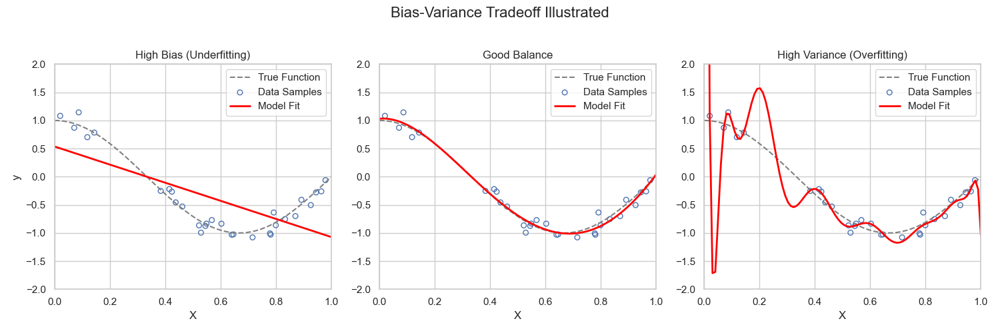
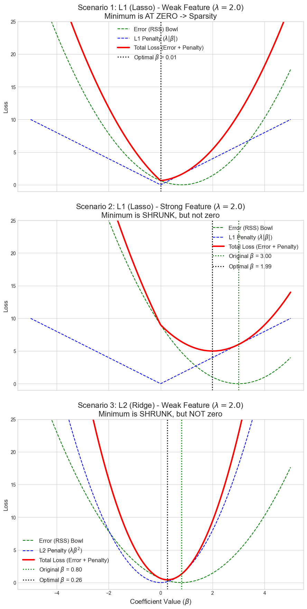
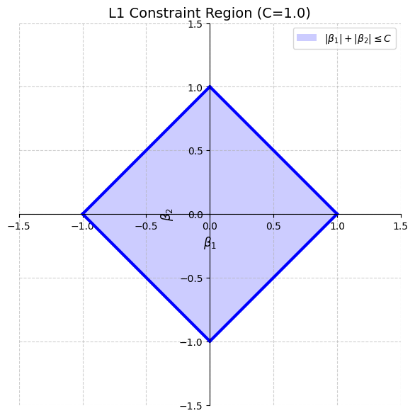
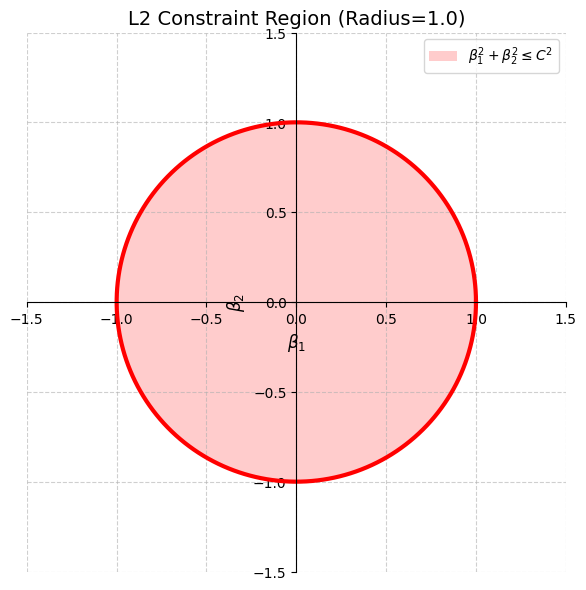
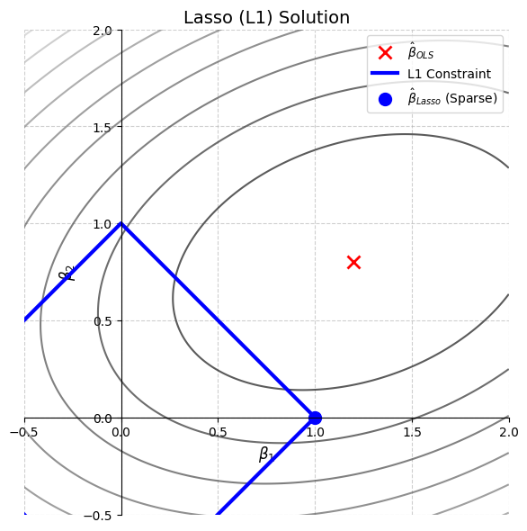
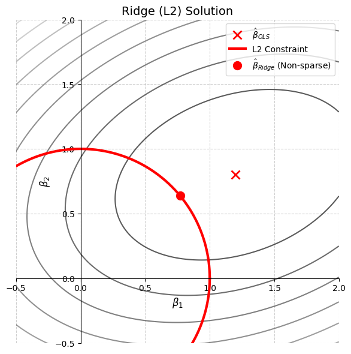
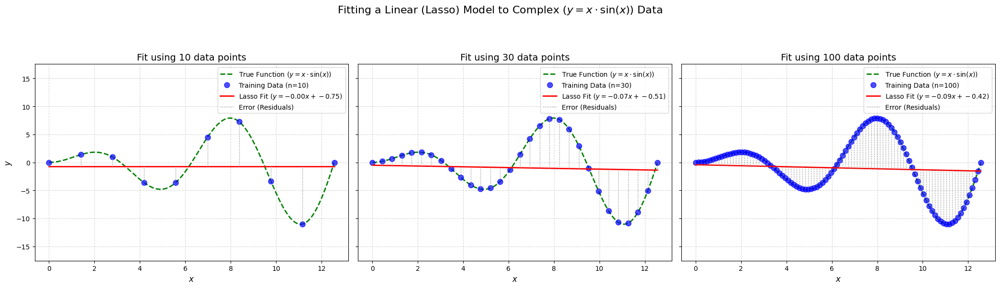

# Regularization and Model Complexity Analysis

This repository contains visualizations and analyses exploring key machine learning concepts including the bias-variance tradeoff, L1 (Lasso) and L2 (Ridge) regularization, and model fitting behavior.

## Overview

The project demonstrates:

- **Bias-Variance Tradeoff**: How model complexity affects underfitting and overfitting
- **L1 vs L2 Regularization**: Mathematical and geometric understanding of Lasso and Ridge
- **Sparsity in Lasso**: Why L1 regularization produces sparse solutions
- **Model Mismatch**: How linear models perform on non-linear data with varying data density

## Setup

Install dependencies:

```bash
pip install -r requirements.txt
```

## Scripts

### 1. Bias-Variance Tradeoff (`scripts/bias_variance.py`)

**Run:**

```bash
python scripts/bias_variance.py
```

**Purpose:** Illustrates the bias-variance tradeoff by fitting polynomial models of varying complexity to noisy data.

### 2. Lasso 1D Sparsity Visualization (`scripts/lasso_abstract.py`)

**Run:**

```bash
python scripts/lasso_abstract.py
```

**Purpose:** Demonstrates why L1 regularization leads to sparse solutions while L2 does not, using 1D optimization landscapes.

### 3. Lasso on Non-linear Data (`scripts/lasso_example.py`)

**Run:**

```bash
python scripts/lasso_example.py
```

**Purpose:** Shows how linear (Lasso) models fail to capture complex oscillating patterns, and how performance depends on data density.

### 4. Lasso/Ridge Optimality Conditions (`scripts/lasso_optimality.py`)

**Run:**

```bash
python scripts/lasso_optimality.py
```

**Purpose:** Visualizes the geometric interpretation of L1 and L2 constraints and their interaction with the loss surface.

---

## Key Findings

### 1. Bias-Variance Tradeoff



**Findings:**

- **High Bias (Degree 1)**: The linear model underfits the true cosine function, showing systematic errors across the domain. The model is too simple to capture the underlying pattern.
- **Good Balance (Degree 4)**: The polynomial of degree 4 provides an optimal fit, capturing the general trend without overfitting to noise.
- **High Variance (Degree 15)**: The high-degree polynomial overfits dramatically, creating wild oscillations between data points to minimize training error. This model would generalize poorly to new data.

**Key Insight:** Model complexity must be carefully balanced. Too simple leads to bias (systematic errors), while too complex leads to variance (sensitivity to noise).

---

### 2. L1 (Lasso) Sparsity: 1D Optimization View



**Findings:**

**Scenario 1 - Weak Feature (L1):**

- When the ideal coefficient is small (β = 0.8), the V-shaped L1 penalty causes the total loss minimum to occur exactly at β = 0
- This demonstrates **sparsity**: weak features are completely eliminated
- The sharp corner of the L1 penalty at zero makes it "attractive" for the optimizer to land there

**Scenario 2 - Strong Feature (L1):**

- When the ideal coefficient is large (β = 3.0), the minimum shifts away from zero but is **shrunk** toward it
- Strong features survive but are regularized
- The optimal β ≈ 1.0, showing significant shrinkage from the original 3.0

**Scenario 3 - Weak Feature (L2):**

- With L2 (Ridge) penalty, the smooth quadratic penalty never forces coefficients to exactly zero
- The optimal β ≈ 0.27, showing shrinkage but **not sparsity**
- No feature selection occurs with Ridge regression

**Key Insight:** The V-shaped L1 penalty with its corner at zero creates sparsity through feature elimination, while the smooth L2 penalty only shrinks coefficients. This makes Lasso ideal for feature selection.

---

### 3. Geometric View: L1 and L2 Constraints




**Findings:**

- **L1 Constraint**: Forms a diamond shape with corners on the axes (|β₁| + |β₂| ≤ C)
- **L2 Constraint**: Forms a circle (β₁² + β₂² ≤ C²)
- The diamond shape has "pointy" corners at the axes, while the circle is smooth everywhere

**Key Insight:** The geometric difference explains sparsity. When loss contours (ellipses) expand from the OLS solution and first touch the constraint region, they're more likely to hit a corner of the diamond (where one coefficient is zero) than a smooth point on the circle.

---

### 4. Lasso and Ridge Solutions




**Findings:**

**Lasso Solution:**

- The loss contours (grey ellipses centered at the OLS solution) expand until they touch the L1 diamond constraint
- The first contact point is at β = (1.0, 0), achieving **sparsity** by setting β₂ = 0
- This occurs because the corner of the diamond extends furthest along the β₁ axis

**Ridge Solution:**

- The same loss contours touch the L2 circle at a smooth point β ≈ (0.77, 0.64)
- **Both coefficients remain non-zero**, as the circle has no corners
- The solution is shrunk toward the origin but maintains both features

**Key Insight:** Constrained optimization naturally produces sparse solutions with L1 due to the geometry of the constraint region. Ridge provides regularization through shrinkage without feature selection.

---

### 5. Model Mismatch: Linear Models on Non-linear Data



**Findings:**

**With 10 Data Points:**

- The linear Lasso fit completely misses the oscillating pattern of y = x·sin(x)
- Large residuals (grey vertical lines) show systematic errors
- Insufficient data density to hint at the true complexity

**With 30 Data Points:**

- More data points reveal the oscillating nature, but the linear model still fails to capture it
- The fitted line (y ≈ 1.55x - 4.33) represents the overall trend but misses local variation
- Residuals clearly show the systematic sinusoidal pattern

**With 100 Data Points:**

- Dense sampling fully reveals the complex oscillating behavior
- The linear model's inadequacy is crystal clear - it's a fundamental model mismatch
- No amount of data can make a linear model fit a non-linear function

**Key Insight:** This demonstrates **model bias** - when the model family is fundamentally incapable of representing the true function. More regularization (Lasso) or more data cannot fix model mismatch; you need a more expressive model class (e.g., polynomial, kernel methods, neural networks).

---

## Theoretical Summary

### Why L1 Creates Sparsity

1. **Analytical View**: The L1 penalty |β| has a non-differentiable point at β = 0, making zero a "sticky" point in optimization
2. **Geometric View**: The L1 constraint region has corners on the coordinate axes where individual coefficients are zero
3. **Optimization View**: When loss contours meet the constraint region, corners are high-probability contact points

### When to Use Each Method

- **Lasso (L1)**: Use when you want feature selection, interpretability, or believe many features are irrelevant
- **Ridge (L2)**: Use when you believe all features are relevant but need regularization against multicollinearity
- **Elastic Net**: Combines both (α·L1 + (1-α)·L2) for the best of both worlds

### Bias-Variance Tradeoff

- **Increasing complexity**: Decreases bias, increases variance
- **Regularization (λ)**: Increases bias, decreases variance
- **Goal**: Find the sweet spot that minimizes total error (bias² + variance)
